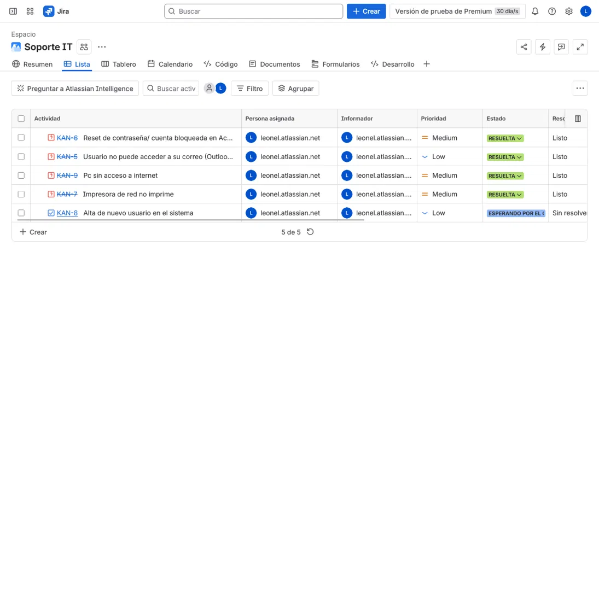
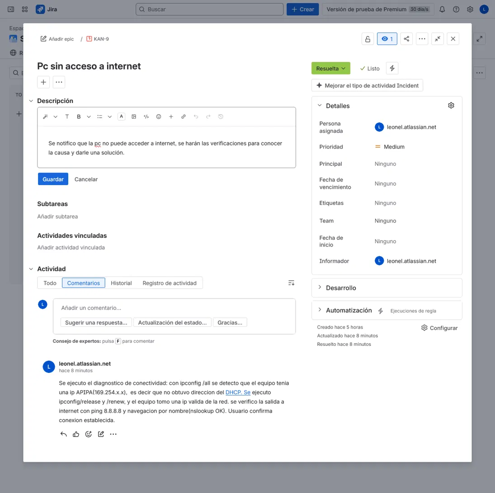
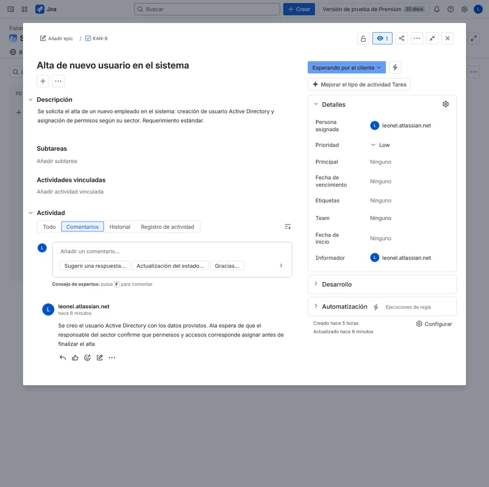
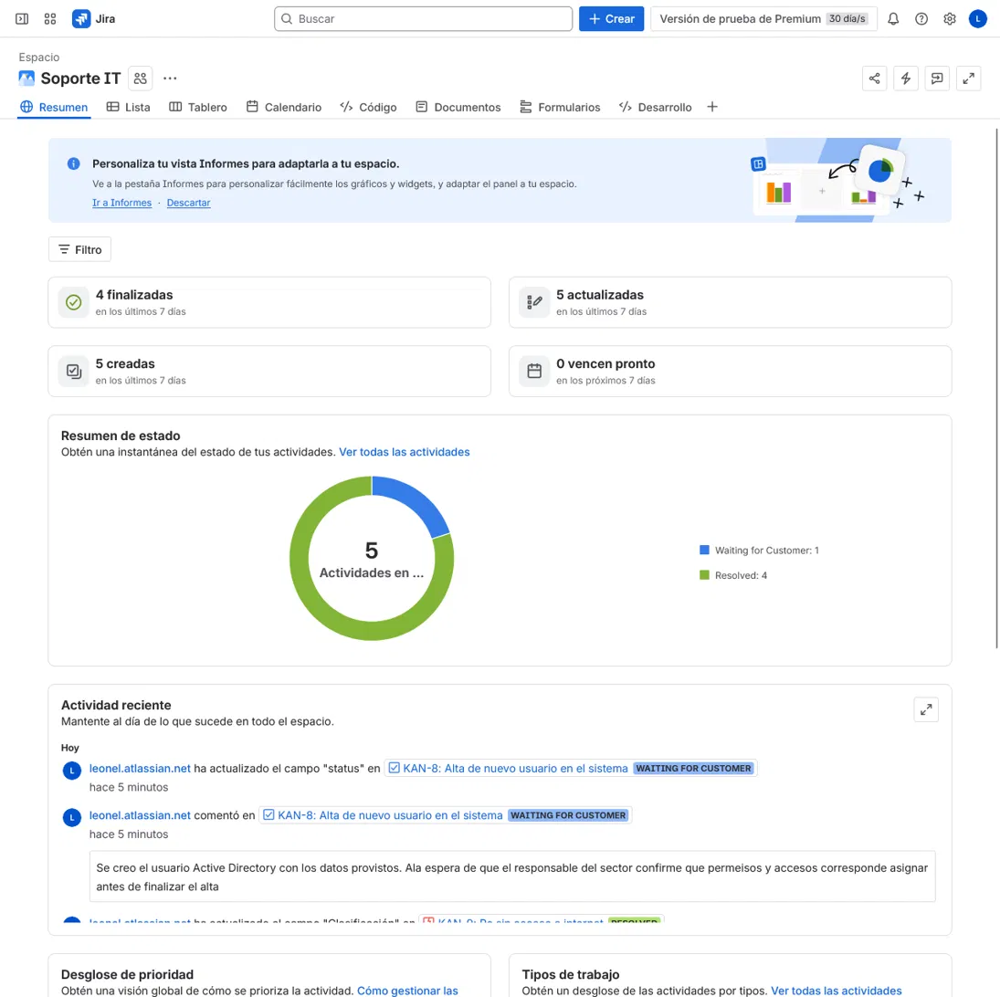

# IT Service Desk — Ticket Lifecycle Management (Jira)

Hands-on lab simulating first-level (N1) IT support ticket management using **Jira**.
This project demonstrates the full ticket lifecycle: intake, categorization, prioritization,
assignment, status tracking, documentation, and resolution — the core daily workflow of a
Help Desk / Service Desk analyst.

## Objective

Reproduce a realistic Service Desk board and manage a set of common support tickets
end to end, distinguishing **incidents** (something broke) from **service requests**
(a standard ask), and documenting each case so any technician could pick it up.

## Tools

- **Jira** (Cloud) — Kanban board with workflow states.
- Ticket types: **Incident** and **Task** (service request).
- Workflow: `To Do → In Progress → Waiting for Customer → Resolved`.

## Board overview

A Kanban board (`Soporte IT`) with a full Service Desk flow:

- **Resolved (4):** incidents handled and documented.
- **Waiting for Customer (1):** request paused pending third-party input.

## Tickets

| ID | Summary | Type | Priority | Final status |
|------|-----------------------------------------------|-----------|----------|---------------------|
| KAN-6 | Password reset / locked account (Active Directory) | Incident | Medium | Resolved |
| KAN-5 | User cannot access email (Outlook / Office 365) | Incident | Low | Resolved |
| KAN-7 | Network printer not printing | Incident | Medium | Resolved |
| KAN-9 | PC with no internet access | Incident | Medium | Resolved |
| KAN-8 | New user onboarding (account provisioning) | Task (request) | Low | Waiting for Customer |

## Incident vs. Service Request

A key Service Desk distinction demonstrated in this board:

- **Incident** — an unplanned interruption (something is broken). KAN-5/6/7/9.
- **Service Request** — a standard, planned ask (e.g. onboarding a new user). KAN-8.

This matters for prioritization and SLA handling.

## Sample case — KAN-9 (network troubleshooting)

The internet-access incident documents a **layer-by-layer network diagnostic**, showing
structured troubleshooting rather than trial and error:

1. `ipconfig /all` → detected an APIPA address (169.254.x.x): the host failed to obtain
   an IP from DHCP.
2. `ipconfig /release` + `ipconfig /renew` → host obtained a valid IP.
3. `ping 8.8.8.8` → confirmed external connectivity.
4. `nslookup` → confirmed name resolution (DNS OK).
5. User confirmed connectivity restored.

## Ticket documentation standard

Every ticket tells a complete story:

- **Description** — the original problem (symptom, since when, scope), written at intake.
- **Comments** — the work performed and the final resolution.

## Service Desk metrics

The project summary provides an at-a-glance view of the queue: resolved vs. pending
tickets, priority breakdown, and work-type distribution — the kind of reporting a Service
Desk relies on to track its workload.

## Skills demonstrated

- Ticket lifecycle management in Jira (intake → resolution).
- Incident vs. service request categorization.
- Prioritization and workflow state management.
- Clear, reproducible ticket documentation.
- Structured network troubleshooting (DHCP / connectivity / DNS).

---

*Part of my IT Support / SysAdmin portfolio.*
